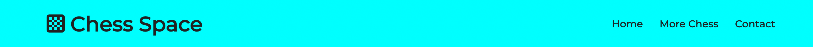
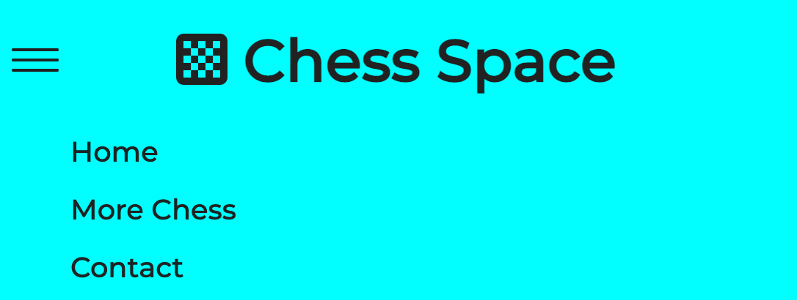
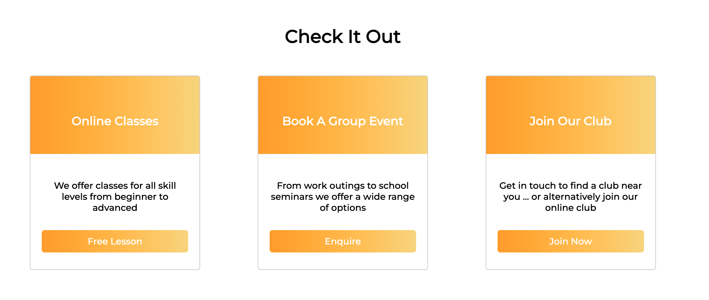
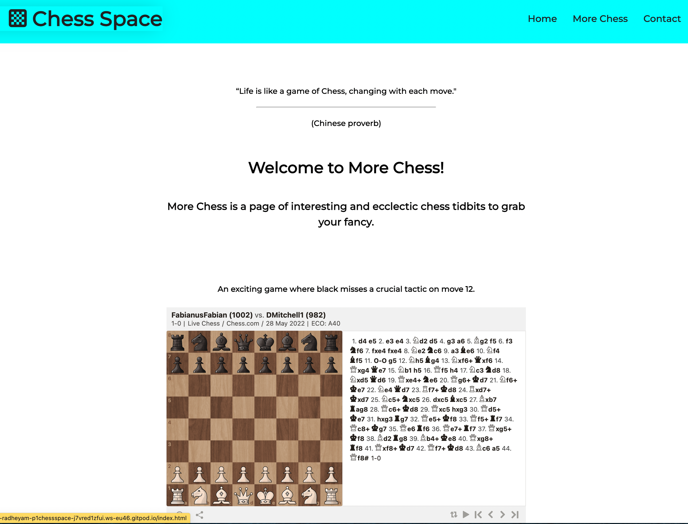

# Chess Space

[View the Live Project](https://radheyam.github.io/p1-chess-space/index.html)

Chess Space is a site created for a hypothetical professional chess player with the aim of increasing his online following and signing users up to his lessons and/or chess club. The site provides clear and obvious ways for the user to sign-up as well as various resources designed to increase user interest in chess and motivate subscription.

## Table of Contents
* [User Experience](#user-experience)
* [Features](#features)
* [Technologies Used](#technologies-used)
* [Testing](#testing)
* [Deployment](#deployment)
* [Credits](#credits)

## User Experience

The primary purpose of the site is to facilitate subscription, and the homepage is designed to catch and hold user attention with the ultimate goal of inspiring subscrition.
   - to this end there is a signup button in the hero section for users coming to the site for that express purpose, no need to waste time searching and potentially loosing the user.
   - the decision was made during development to move the Why Chess section from middle to bottom to give the Offer Cards a more prominent position, and in terms of overall page flow, giving a nice break between the large and colourful Hero and Why Chess sections.  If the user is not quite ready, they should still have the options in mind while engaged with the Why Chess section.
   - Orange is used for the 'call to action' button/cards as it stands out nicely and contrasts well with the two images and the header and footer 'aqua' colour scheme.
   - The More Chess page is for users new to chess and looking for further avenues into the online community.  The page offers value to the user and also to the overall goal of the site in that the user will remember where they started, and should return if they desire lessons or to get involved in a club community etc.

## Features

  

-  _Navigation_

  

   - A consistent navigation bar across all three pages on the site with a logo to the right and links to Home, More Chess and Contact pages. The Nav bar is always displayed even when scrolling down the site which allows the user to change pages effortlessly.

   - the logo and nav options are cursor responsive

  
  

  

   - On smaller screen widths the nav bar collapses into a hamburger style icon which expands upon interaction. This provides space saving and intuitive navigation to the user.

  

  

-  _Hero Section_

  

   - The user is greeted with a full-screen image and text clearly explaining the purpose of the site and allowing them to get involved immediately with a cursor responsive 'get involved' button.

  

  

-  _Offer Cards_

  

   - Three attractively designed offer cards with clear titles and descriptions with the sign-up options for the user. The cards respond to a hovering cursor providing satisfying feedback to the user.

  

  

-  _Why Play Chess Section_

  

   - If the user is not quite ready to sign-up this section provides a (hopefully) humourous and informative set of reasons why they may want to get involved.

  

  

-  _Footer_

   - a footer consistent across the site, provides external link icons for Chess Space social media sites.

  

  

-  _More Chess Page_

   - More interesting resources to do with chess, providing fundamental value to the interested user.

   - The user gains insight into the wider chess community and some more reasons why signing up is a good idea!

   - Includes a number of interactive elements for the user to control.

  

  

-  _Contact Page_

  

   - All the links on the home page buttons lead to this sign-up form.

   - Welcoming text, thematic background image, clear instructions and cursor responsive elements should all hold the user's attention and provide a pleasant sign-up experience.

  

  

-  _Features for Future Implementation:_

   - A Blog Page.

   - A Community Discussion Forum.

   - Chess Club Leaderboard for members.

## Technologies Used

### Languages
- HTML5.
- CSS3.
- JavaScript (2 scripts used, one for the Font Awesome icons and one for the interactive iframe on the More Chess page).

### Other Technologies and Programmes

- [Git](https://git-scm.com/) - for version control.
- [Github](https://github.com/) - repository to store the project files and host/share the project.
- [Gitpod](https://gitpod.io/) - browser IDE used to write the project code.
- [Convertio](https://convertio.co/jpg-webp/) - used to convert jpg images to better optimised webp format.
- [Optimizilla](https://imagecompressor.com/) - used to optimise the images for better performance.
- Chrome developer tools - used to view, edit and test the site throughout development.

## Testing

### Code Validation

- W3 Nu HTML Checker - No errors or warnings to show:
   - [index.html results.](/media/validation-results/index-html.pdf)
   - [more-chess.html results.](/media/validation-results/more-chess-html.pdf)
   - [contact.html results.](media/validation-results/contact-html.pdf)
- W3C CSS Validation Service - No error found:
   - [CSS test results.](media/validation-results/css-results.pdf)

### Performance, Compatibility and Responsiveness 
- Chrome Developer Tools - Lighthouse:
   - [Test Results](/media/lighthouse-results/)
- Responsive Across Screen Sizes:
   - The three pages have been extensively tested on various simulated screen sizes using Chrome Developer Tools throughout development for the best possible experience on any screen size.
   - Tested on a windows laptop, mac mini with a widescreen display, google pixel 3 and an ipad pro 12.9".
- Browser Compatipility - tested in the following with satisfactory results:
   - Safari - version 15.4 (17613.1.17.1.13)
   - Chrome - version 102.0.5005.61 (Official Build) (arm64)
   - Firefox - version 100.0.2 (64-bit)
   - Microsoft Edge - version 102.0.1245.33 (Official Build)(64-bit)

## Deployment

## Credits
### Code

- The Hamburger Menu was designed following a video tutorial by [Kevin Powell](https://youtu.be/8QKOaTYvYUA) on Youtube.

- The Offer Cards - A video tutorial by [Web Zone](https://youtu.be/StnlVOm3ZZg) on Youtube was used to get the basic structure after which the code was improved upon to fit the website design.

- The Footer Code comes from the [Love Running Project](https://github.com/Code-Institute-Solutions/love-running-2.0-sourcecode) from code institute, the CSS was edited/added to, to fit the design of Chess Space.

- The Contact form code is also based on the code in the [Love Running Project](https://github.com/Code-Institute-Solutions/love-running-2.0-sourcecode) from Code Institute, but was edited to fit the Chess Space design, colour scheme etc.

### Content

- The More Chess page contains quotes taken from [chess.com](https://www.chess.com/forum/view/general/300--chess-quotes).

- The More Chess page contains an interactive board game iframe from [chess.com](https://www.chess.com/home) and two Youtube videos from [GingerGM](https://www.youtube.com/c/GingerGM) and [Chess Press](https://www.youtube.com/channel/UCd5tjdWdIJYqA5Yg7omrgZQ)..

- The remaining written content is original work by the developer.

- The colour scheme developed naturally from the primary colours of the main images and in the case of text was based on good contrast with the background for the best readability possible.

### Images

Images came from [pexels.com](https://www.pexels.com/search/chess/).
- Hero Image

  - [Ylanite Koppens - Chess Pieces on Table](https://www.pexels.com/photo/chess-pieces-on-table-1152662/).

- Why Chess Image

  - [Karolina Grabowska - Black Chess Pieces on Yellow Background](https://www.pexels.com/photo/black-chess-pieces-on-yellow-background-5477776/).

- Contact Image

  - [George Becker - Black Queen Chess Piece Standing](https://www.pexels.com/photo/black-queen-chess-piece-standing-129742/).

  
### Font Libraries

- The Icons in the logo and footer are free to use fonts from [Font Awesome](https://fontawesome.com/).
- The font comes from the [Google Fonts](https://fonts.google.com/) library.

### Acknowledgements

I would like to thank Brian Maharia for his help throughout project development.  I would also like to thank Code Institute for providing all the learning materials which made the project possible.