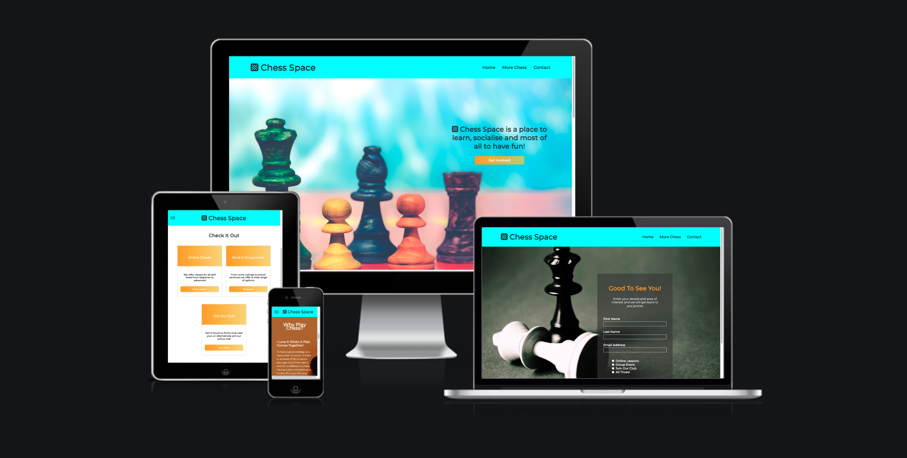
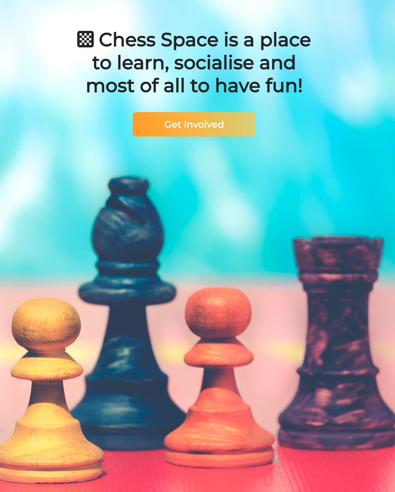
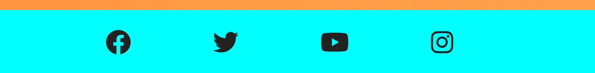
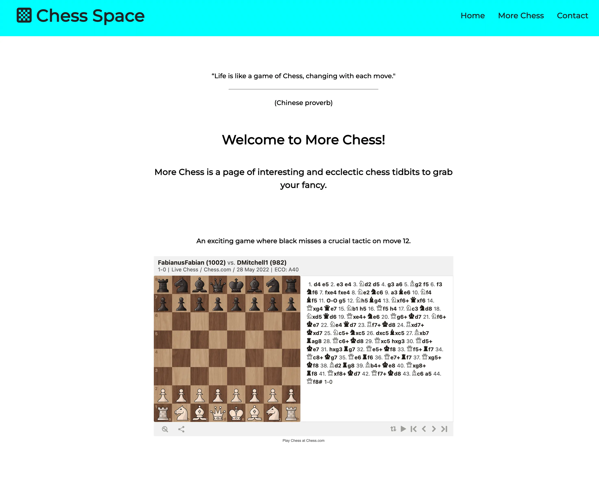

# Chess Space

[View the Live Project](https://radheyam.github.io/p1-chess-space/index.html)

Chess Space is a site created for a hypothetical professional chess player with the aim of increasing his online following and signing users up to his lessons and/or chess club. The site provides clear and obvious ways for the user to sign-up as well as various resources designed to increase user interest in chess and motivate subscription.

The design ethos throughout development has been to create a visually attractive and navigationally intuitive site providing the user with an engaging and enjoyable environment, and offering real value with informative and entertaining content.  Through providing value in this way the developer hopes to encourage the user to subscribe to one of the offers displayed and engage/become invested in the community surrounding the site.

The target audience for the site includes users of all chess skill levels interested in joining a chess community, taking lessons, organising a chess event, or learning more about chess in general.  The design allows those seeking to sign-up, or find out more about sign-up options, to do so quickly and easily and provides more information and resources for users interested in researching chess further before signing-up.

## Table of Contents
* [Features](#features)
* [Technologies Used](#technologies-used)
* [Testing](#testing)
* [Deployment](#deployment)
* [Credits](#credits)

## Features

  

-  _Navigation_

  

   - A consistent navigation bar across all three pages with a logo to the right and links to Home, More Chess and Contact pages. The Nav bar is always displayed even when scrolling down the site which allows the user to change pages effortlessly.

   - The logo and nav options are cursor responsive.

  
  

  

   - On smaller screen widths the nav bar collapses into a hamburger style icon which expands upon interaction giving space saving and intuitive navigational options to the user.

  

  

-  _Hero Section_

  

   - The user is greeted with a full-screen image with text clearly explaining the purpose of the site and allowing them to get involved immediately with a responsive 'Get Involved' button.  Some users will visit to sign up immediately and that is another good reason to include a button on the Hero Image.

  

  

-  _Offer Cards_

  

   - Three colourful and responsive offer cards with clear titles and descriptions, with sign-up options for the user. 
   - The cards respond to a hovering cursor providing satisfying feedback.
   - A design decision was made during development to move the Offer Cards from the bottom, as initially planned, to just under the Hero Image to make them more relevant and visible.  They also create a nice space between the two large and colourful Hero and Why Chess sections.

  

  

-  _Why Play Chess Section_

  

   - If the user is not quite ready to sign-up this section provides a (hopefully) humourous and informative set of reasons why they may want to get involved.

  

  

-  _Footer_

   - A footer consistent across the three pages provides external link icons for Chess Space social media sites.

  

  

-  _More Chess Page_

   - More interesting resources to do with chess, providing fundamental value to the interested user.

   - The user gains insight into the wider chess community and some more reasons why signing up is a good idea!

   - Includes a number of interactive elements for the user to engage with.

  

  

-  _Contact Page_

  

   - All the links on the home page buttons lead to this sign-up form.

   - Welcoming text, thematic background image, clear instructions and cursor responsive elements should all hold the user's attention and provide a pleasant sign-up experience.

  

  

-  _Features for Future Implementation:_

   - A members section with chess club leaderboard.

   - A Blog Page.

   - A community discussion forum.

   - Sign-up buttons/cards on the More Chess page.

   - A 404 error page.

## Technologies Used

### Languages
- HTML5.
- CSS3.
- JavaScript (two scripts used, one for the Font Awesome icons and one for the interactive iframe on the More Chess page).

### Other Technologies and Programmes

- [Git](https://git-scm.com/) - for version control.
- [Github](https://github.com/) - repository to store the project files and host/share the project.
- [Gitpod](https://gitpod.io/) - browser IDE used to write the project code.
- [Convertio](https://convertio.co/jpg-webp/) - used to convert jpg images to better optimised webp format.
- [Optimizilla](https://imagecompressor.com/) - used to optimise the images for better performance.
- Chrome developer tools - used to view, edit and test the site throughout development.

## Testing

### Code Validation

- W3 Nu HTML Checker - No errors or warnings to show:
   - [index.html results.](/media/validation-results/index-html.pdf)
   - [more-chess.html results.](/media/validation-results/more-chess-html.pdf)
   - [contact.html results.](media/validation-results/contact-html.pdf)
- W3C CSS Validation Service - No error found:
   - [CSS test results.](media/validation-results/css-results.pdf)

### Performance, Compatability and Responsiveness 
- Chrome Developer Tools - Lighthouse:
   - [Test Results](/media/lighthouse-results/)
- Responsive Across Screen Sizes:
   - The three pages have been extensively tested on various simulated screen sizes using Chrome Developer Tools throughout development for the best possible experience on any screen size.
   - Tested by the developer on a Windows 11 laptop, Mac Mini with a widescreen display, Google Pixel 3a and an Ipad Pro 12.9".
- Browser Compatipility - tested in the following browsers with satisfactory results:
   - Safari - version 15.4 (17613.1.17.1.13)
   - Chrome - version 102.0.5005.61 (Official Build) (arm64)
   - Firefox - version 100.0.2 (64-bit)
   - Microsoft Edge - version 102.0.1245.33 (Official Build)(64-bit)

### Known Bugs and Room For Improvement

 - No obvious bugs were found during the above testing process that could not be rectified.
 - Lighthouse testing revealed some areas for improvement in optimisation and best practice, but the solutions were deemed to be outside the scope of this CSS and HTML focused project.

## Deployment

Within the Github respository window select the 'settings' tab menu and navigate to 'pages'.
Select 'Branch: main' from the dropdown menu and execute. The site will be live in a matter of minutes, and the live URL will be displayed on the same deployment page.  Any changes made after deployment in the main branch will be added to the live site after they are committed and pushed to the Github repository.

## Credits
### Code

- The Hamburger Menu was designed following a video tutorial by [Kevin Powell](https://youtu.be/8QKOaTYvYUA) on Youtube.

- The Offer Cards - A video tutorial by [Web Zone](https://youtu.be/StnlVOm3ZZg) on Youtube was used to get the basic structure after which the code was improved upon to fit the website design.

- The Footer Code comes from the [Love Running Project](https://github.com/Code-Institute-Solutions/love-running-2.0-sourcecode) from code institute, the CSS was edited/added to, to fit the design of Chess Space.

- The Contact form code is also based on the code in the [Love Running Project](https://github.com/Code-Institute-Solutions/love-running-2.0-sourcecode) from Code Institute, but was edited to fit the Chess Space design, colour scheme etc.

### Content

- The More Chess page contains quotes taken from [chess.com](https://www.chess.com/forum/view/general/300--chess-quotes).

- The More Chess page contains an interactive board game iframe from [chess.com](https://www.chess.com/home) and two Youtube videos from [GingerGM](https://www.youtube.com/c/GingerGM) and [Chess Press](https://www.youtube.com/channel/UCd5tjdWdIJYqA5Yg7omrgZQ)..

- The remaining written content is original work by the developer.

- The colour scheme developed naturally from the primary colours of the main images and in the case of text was based on good contrast with the background for the best readability possible.

### Images

Images come from [pexels.com](https://www.pexels.com/search/chess/).
- Hero Image

  - [Ylanite Koppens - Chess Pieces on Table](https://www.pexels.com/photo/chess-pieces-on-table-1152662/).

- Why Chess Image

  - [Karolina Grabowska - Black Chess Pieces on Yellow Background](https://www.pexels.com/photo/black-chess-pieces-on-yellow-background-5477776/).

- Contact Image

  - [George Becker - Black Queen Chess Piece Standing](https://www.pexels.com/photo/black-queen-chess-piece-standing-129742/).

  
### Font Libraries

- The Icons in the logo and footer are free to use fonts from [Font Awesome](https://fontawesome.com/).
- The Monserrat font used comes from the [Google Fonts](https://fonts.google.com/) library.

### Acknowledgements

I would like to thank Brian Macharia for his help throughout project development.  I would also like to thank Code Institute for providing all the learning materials which made the project possible.